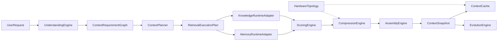
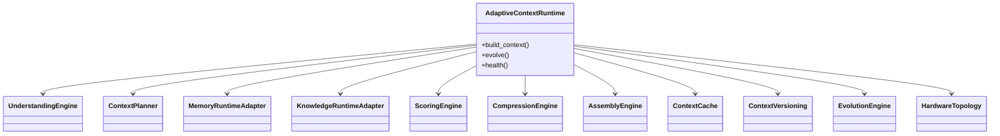
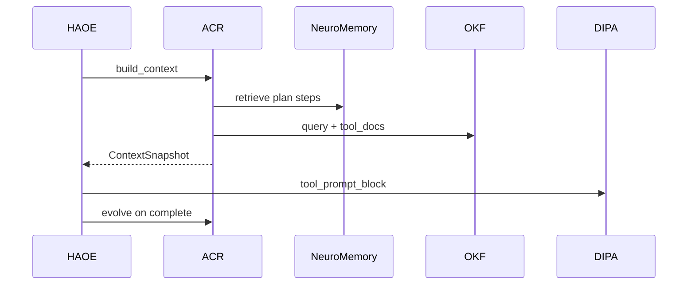
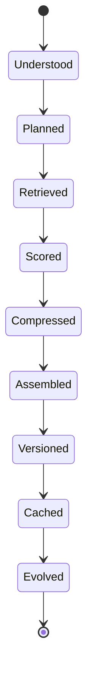

# ACR Architecture

## Pipeline (compiler metaphor)

## Class diagram

## Sequence (HAOE chat)

## Context lifecycle

## Separation

- ADR-0001: Context OS is not RAG
- ADR-0002: ACR wraps Mem0 + OKF; never merges storage
- ADR-0003: measurable compression, not fixed %
- ADR-0004: HardwareTopology HAL (NUMA if present else local)

## Package

`neuroswarm_arm/runtime/acr/` — see [developer.md](developer.md).
