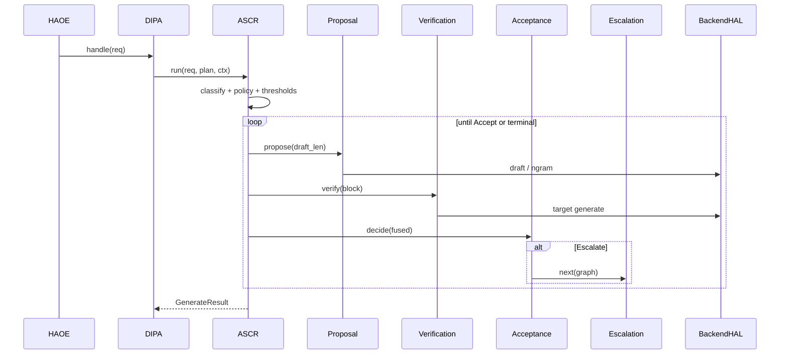
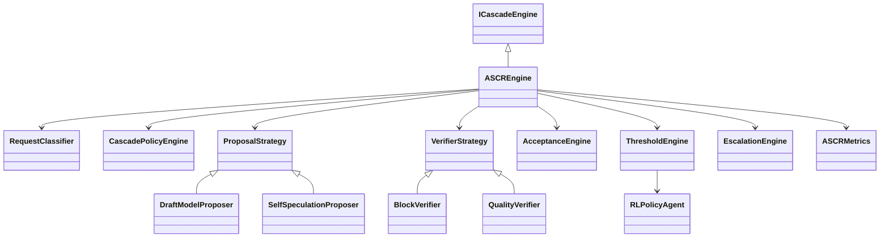

# ASCR Architecture

**Adaptive Speculative Cascade Runtime (ASCR)** — ArmCascade throughput engine for NEXUS-ARM.

Formerly: *Speculative Cascade Router*. Renamed because ASCR owns proposal, verification, confidence, acceptance, escalation, adaptation, telemetry, and ARM-aware scheduling — not only model selection.

## Placement

| Name | Role |
|------|------|
| **DIPA** | Layer 2 Inference Runtime Kernel (ADR-0001) |
| **ASCR** | Throughput subsystem implementing `ICascadeEngine` |
| **ArmCascade** | Product/family name |

Package: `neuroswarm_arm.runtime.armcascade`  
Factory: `build_ascr(...)` (wired from `build_dipa()`)

## Request path

## Module map

| Package | Role |
|---------|------|
| `classifier/` | Workload → strategy hints |
| `proposal/` | Plugin proposers + registry |
| `verification/` | Plugin verifiers |
| `acceptance/` | Accept / partial / escalate / adapt |
| `confidence/` | Multi-signal fusion 0–1 |
| `thresholds/` | Dynamic draft_len / τ (RL-agent port) |
| `escalation/` | DAG policy graphs |
| `policies/` | Peer-layer fusion (AQR/AWPP/MAKS/RTG hints) |
| `metrics/` | `ascr_*` + `dipa_cascade_*` aliases |
| `arm/` | NUMA / affinity / Performix hooks |
| `plugins/` | Side-effect registration bootstrap |
| `config/` | YAML + `NSA_ASCR_*` |

## Class diagram (core)

## Design decisions

1. Plugin strategies — new algorithms = class + `@register_*` + YAML.
2. Adaptive thresholds only — RLObservation/RLAction ready for PPO.
3. Escalation = DAG — Tool/Mem/Tier edges, not linear-only.
4. Honest degradation — no logits → quality-cascade; metrics labeled.
5. Connectors only — never own AQR/MAKS/AWPP/RTG (ADR-0003).
6. No SGLang kernel duplication (ADR-0007).

## Architecture review

**Strengths:** modular, extensible, ADR-aligned, mock-testable, ARM adapters isolated.

**Tradeoffs:** HTTP llama-server limits true token-level verify; quality-cascade remains for Axion MVP honesty.

**Alternatives rejected:** replace DIPA; hardcode EAGLE-3; reimplement SGLang spec.

**Known limitations:** EAGLE/Medusa/PARD stubs; single-NUMA Axion; RL agent heuristic-only; CXL/MTE UNAVAILABLE.

**Performance expectations:** 1.5–2.3× effective tok/s when accept ≥70% on real draft+block path; measure on Axion before claiming.

See also: [research.md](research.md), [ADR-0008](../dipa/adr/0008-ascr-replaces-heuristic-cascade.md).
