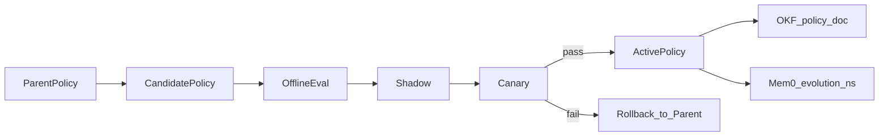

# AROP diagrams

## Closed-loop sequence

```mermaid
sequenceDiagram
  participant Obs as ObservationProviders
  participant Know as KnowledgeEngine
  participant Refl as ReflectionStrategy
  participant Opt as OptimizationEngine
  participant Exp as ExperimentEngine
  participant Val as ValidationEngine
  participant Safe as SafetyEngine
  participant Dep as DeploymentEngine
  participant Reg as PolicyRegistry

  Obs->>Know: NormalizedObservation
  Know->>Refl: KnowledgeView
  Refl->>Opt: PolicyDelta
  Opt->>Reg: RuntimePolicy candidate
  Opt->>Exp: CandidatePolicy
  Exp->>Val: offline+shadow scores
  Val->>Safe: ValidationReport
  Safe->>Dep: pass
  Dep->>Reg: canary/promote/rollback
  Dep->>Know: KnowledgeUpdate
```

## Policy lineage


