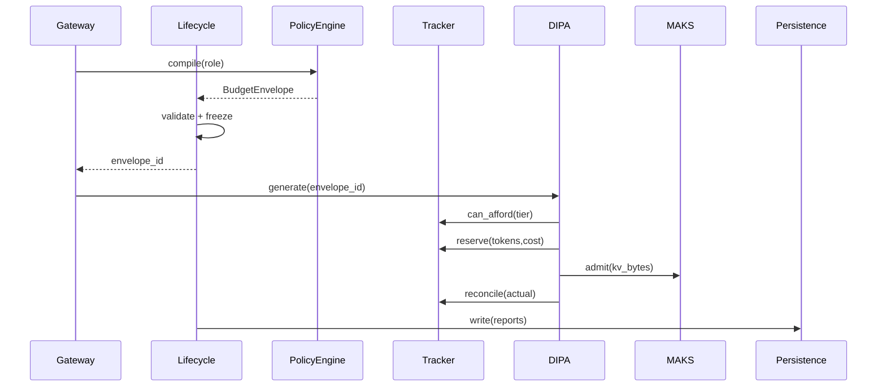

# Budget Envelope Lifecycle

## State machine

```
Create → Validate → (Optimize ↔ Validate)* → Freeze → Execute
  → Consume → CheckViolations → (Continue | Degrade | Abort)
  → Report → Persist
```

## Phases

### 1. Create

`PolicyEngine.compile(agent_role, tenant_id, request_id)` produces an unfrozen `BudgetEnvelope` from:

- OKF policy documents (`okf/policies/cost-budget.md`)
- Agent profile frontmatter
- `BudgetRuntimeConfig` / `NSA_BUDGET_*` env defaults
- Request overrides (deadline, priority, quality)

### 2. Validate

`BudgetValidator` checks every hard dimension: `projected ≤ limit`. Soft violations emit warnings but do not reject. Returns `AdmitDecision(accepted, reasons, soft_warnings)`.

### 3. Optimize (if needed)

When soft-infeasible or planner requests a cheaper plan, `BudgetOptimizer` walks the configurable degrade ladder:

1. Lower model tier  
2. Lower quantization  
3. Cut reasoning tokens  
4. Trim context  
5. Disable speculation  
6. Drop tools  
7. Cut retries  
8. Abort  

Each step re-validates. Ladder order and enabled steps come from config/plugins — never hardcoded production ceilings.

### 4. Freeze

`envelope.freeze()` returns an immutable copy. Lifecycle refuses further limit mutation. Runtime mutations go only through `BudgetTracker` / `BudgetRuntimeState`.

### 5. Execute

Peers receive `envelope_id` + read-only envelope snapshot. Work without a frozen envelope is rejected at ARMORA admission.

### 6. Consume / Reconcile

For each resource event (tokens, KV pages, tool call, CPU seconds):

```
estimate(op) → reserve(p90) → execute → reconcile(actual)
```

Hard breach mid-flight → `FailurePolicy` (abort / degrade / escalate).

### 7. Report

Generate: Budget, Execution, Cost, Energy, Planner, Resource, Telemetry reports.

### 8. Persist

Write history via configured `IPersistence` backend (SQLite default).

## Sequence (chat path)



## AsyncIO

`BudgetLifecycle.run()` is async. Transitions emit OpenTelemetry spans named `budget.lifecycle.<phase>`.
