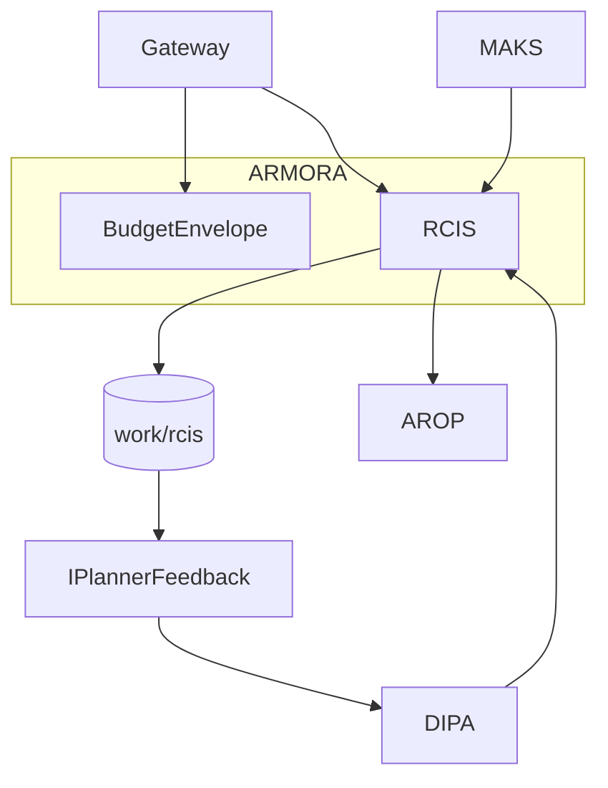
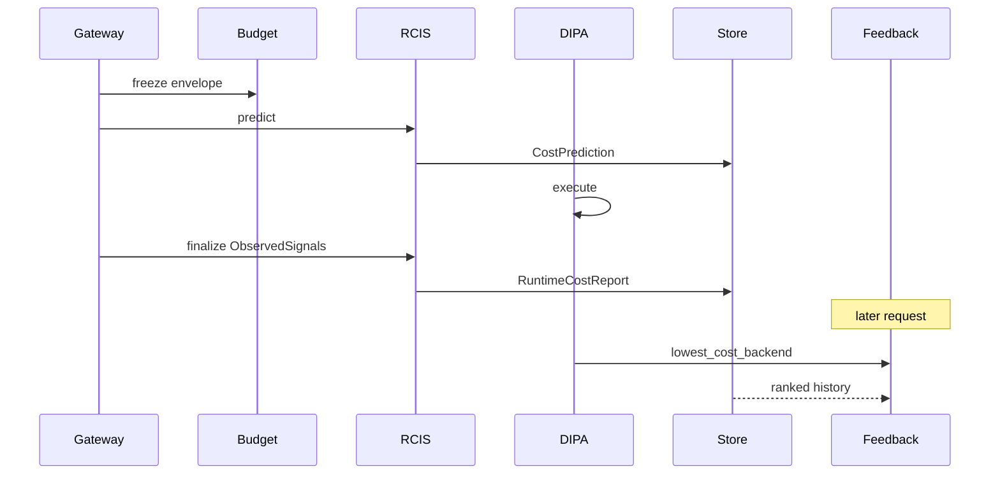

# RCIS Diagrams

## Ownership

```mermaid
flowchart TB
  subgraph armora [ARMORA]
    Budget[BudgetEnvelope]
    RCIS[RCIS]
  end
  GW[Gateway] --> Budget
  GW --> RCIS
  DIPA --> RCIS
  MAKS --> RCIS
  RCIS --> Store[(work/rcis)]
  Store --> Feedback[IPlannerFeedback]
  Feedback --> DIPA
  RCIS --> AROP
```

## Closed loop

```mermaid
sequenceDiagram
  participant GW as Gateway
  participant Bud as Budget
  participant RCIS as RCIS
  participant DIPA as DIPA
  participant Store as Store
  participant FB as Feedback

  GW->>Bud: freeze envelope
  GW->>RCIS: predict
  RCIS->>Store: CostPrediction
  DIPA->>DIPA: execute
  GW->>RCIS: finalize ObservedSignals
  RCIS->>Store: RuntimeCostReport
  Note over FB: later request
  DIPA->>FB: lowest_cost_backend
  Store-->>FB: ranked history
```
