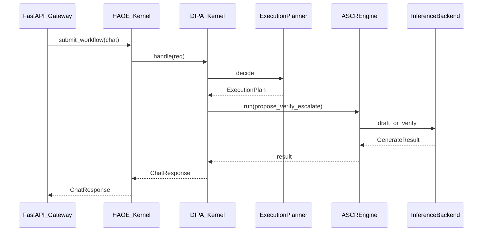

# DIPA Architecture

**DIPA (Disaggregated Inference Proxy for Agents)** is Layer 2 / Plane 3 of NEXUS-ARM: the **Inference Runtime Kernel**. Every inference decision flows through DIPA. HAOE coordinates agents; DIPA owns backends, cascade, streaming, recovery, and asks AQR / AWPP / MAKS via connectors.

Package: `neuroswarm_arm.runtime.dipa`  
Factory: `build_dipa(...)`  
Compat: `neuroswarm_arm.inference.cascade.CascadeRouter` (delegates to DIPA)

## Request path

**ASCR** (Adaptive Speculative Cascade Runtime) replaces the former Speculative Cascade Router. See [docs/armcascade/Architecture.md](../armcascade/Architecture.md) and [ADR-0008](adr/0008-ascr-replaces-heuristic-cascade.md).

## Lifecycle (never skip)

Admitted → Planned → Classified → Intent → Model → Backend → Hardware → Policy → Quant(AQR) → Warm(AWPP) → KV(MAKS) → Cascade/Prefill/Decode → Stream → Metrics → Completed

## Subsystems

| Package | Role |
|---------|------|
| `router/` | Execution planner, decision/policy engines |
| `routing/` | Model/backend/quant/topology/prefill/decode scoring |
| `execution/` | Context, graph, pipeline, prefill/decode pools |
| `cascade/` | Compat shim — production path is **ASCR** (`runtime/armcascade/`) |
| `backends/` | Plugin HAL: llama.cpp, SGLang, vLLM, ExecuTorch, LiteRT, mock |
| `pd/` | Prefill/Decode managers, KV transfer, chunk planner/executor, batch scheduler |
| `streaming/` | SSE / WS / gRPC / chunked transports |
| `recovery/` | Retry, circuit breaker, fallback, degraded mode |
| `batching/` | Micro / dynamic / continuous batching |
| `warm_pool/` | Model/session pools (AWPP fills intent) |
| `aqr/` `awpp/` `cache/` | Connectors only — never own peer layers; `PrefixCacheManager` bridges SGLang radix |
| `telemetry/` | `dipa_*` metrics, OTEL, ARM PMU hooks |
| `config/` | YAML policies (routing, cascade, hardware, …) |

PD redesign docs: [pd-architecture.md](pd-architecture.md), [sglang-gap-analysis.md](sglang-gap-analysis.md), [migration-pd.md](migration-pd.md), ADR-0006 / ADR-0007.

## Backend plugin rule

Implement `InferenceBackend` + `registry.register(...)`. Zero kernel changes for new runtimes.

## Axion-safe HAL

Affinity best-effort; NUMA single-node fallback; MTE/CXL/SME reported `UNAVAILABLE` until present. See ADR-0005 pattern in HAOE — DIPA mirrors it.

## Configuration

Env prefix `NSA_DIPA_*` + YAML under `runtime/dipa/config/`.

## Integration rules

- HAOE never imports DIPA concretes beyond injected `handle()` protocol
- Gateway may hold both `dipa` and compat `cascade`
- AQR / AWPP / MAKS only via connectors
