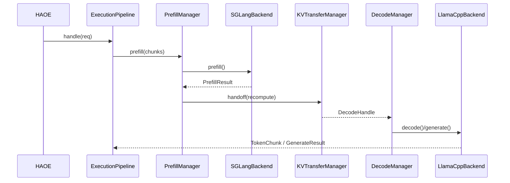

# DIPA Prefill/Decode Architecture (SGLang × llama.cpp)

DIPA remains Layer 2 / Plane 3: the **Inference Runtime Kernel** (ADR-0001). This document describes the PD-aware redesign.

## Role split

| Phase | Runtime | Rationale |
|-------|---------|-----------|
| Prefill | **SGLang** (CPU on Axion; GPU later) | RadixAttention, chunked prefill, continuous batch — encapsulated only |
| Decode | **llama.cpp + KleidiAI** | Axion-optimized generation, cascade tiers |
| Fused fallback | llama.cpp `generate()` | Short prompts, SGLang down, cascade without PD |

## Request path (PD soft / recompute)

## Subsystems (`runtime/dipa/pd/`)

| Component | Role |
|-----------|------|
| `PrefillManager` | Selects prefill backend; runs chunked prefill |
| `DecodeManager` | Selects decode backend; streams tokens |
| `KVTransferManager` | `native_sglang` \| `recompute` \| `unavailable` |
| `ChunkPlanner` / `ChunkExecutor` | Split long prompts; delegate chunked prefill to SGLang |
| `BatchScheduler` | Facade over existing batching helpers |
| `PrefixCacheManager` | Warm/query prefix hits (SGLang radix + MAKS + llama slots) |

## Feature flags

| Env | Values | Default |
|-----|--------|---------|
| `NSA_DIPA_PD_MODE` | `off` \| `soft` \| `native` | `off` |
| `NSA_DIPA_PREFILL_BACKEND` | `sglang` \| `llama_cpp` | `sglang` when soft/native |
| `NSA_DIPA_DECODE_BACKEND` | `llama_cpp` | `llama_cpp` |
| `NSA_DIPA_SGLANG_URL` | HTTP base URL | empty |
| `NSA_DIPA_CHUNK_SIZE` | tokens (approx words×1.3) | `2048` |

## Integration rules (unchanged)

- HAOE never imports DIPA concretes beyond `handle()`
- ARMORA uses `IInferenceEngine` only
- AQR / AWPP / MAKS / RTG via connectors / hooks only
- Upper layers **never** import `sglang`

## Axion honesty

- Default heterogeneous transfer = `recompute`
- Mooncake/NIXL = `FeatureStatus.UNAVAILABLE` unless detector says otherwise
- Single NUMA node; affinity best-effort (ADR-0005)
