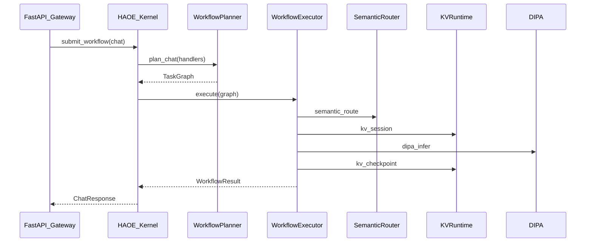
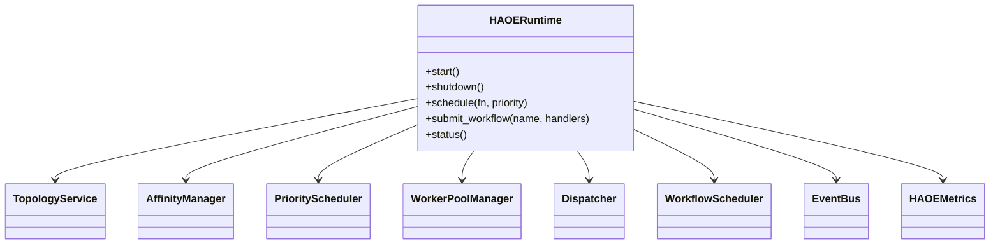

# HAOE Architecture

**HAOE (Heterogeneous Agentic Orchestration Engine)** is Layer 1 / Plane 4 of NEXUS-ARM: the **agent runtime kernel**. Every request executes through HAOE. HAOE **coordinates** inference via DIPA (Layer 2); it never performs inference and never imports backend clients.

Package: `neuroswarm_arm.runtime.haoe`  
Factory: `build_haoe(...)`  
Facade: `neuroswarm_arm.router.HAOEScheduler` (compat alias)

## Request path



HAOE **coordinates** inference via DIPA; it never performs inference and never imports backend clients.
## Class overview



## Task graph model

Every API request becomes a DAG:

```
API Request → TaskGraph → Planner → Agent Tasks → Dependencies
  → Execution Graph → Completion Graph
```

Supported: hard/conditional edges, fan-out/fan-in, checkpoint nodes, retry, cancellation, priority inheritance, critical-path detection.

Task states: `Queued → Ready → Running → Paused → Waiting → Retry → Cancelled | Completed | Failed`.

## Scheduler design

- Priority classes: CRITICAL / HIGH / NORMAL / BACKGROUND
- Dynamic aging, deadline urgency, latency-budget scoring
- Cost-aware allocation via `TaskCostEstimator` + optional KV pressure protocol
- Eight pools: Inference, Memory, Embedding, Tool, Planner, Background, Telemetry, Maintenance
- Work stealing: per-worker deque (owner L, thief R) + global overflow; locality tag preferred

## Worker / thread model

- Kernel threads per pool (daemon), polling `PriorityScheduler`
- Chat workflows run on the **deterministic DAG path** (`execute_graph`) for latency predictability
- Background work can be enqueued onto pools for true steal-based parallelism
- Executors: Inline / Thread / Process / Async / Native (stub for future Rust)

## CPU affinity strategy

```
HardwareDetector → TopologyService → AffinityManager → AffinityProvider
  → sched_setaffinity / taskset (Linux) | no-op (Windows / restricted)
```

Never hardcodes NUMA. On GCP Axion (homogeneous CPUs, no user-space NUMA guarantees) affinity is best-effort and degrades silently.

## Hardware abstraction (providers)

| Provider | Today (Axion) | Future |
|----------|---------------|--------|
| CPU / Topology | `/proc` + sysfs / `os.cpu_count` | hwloc |
| Affinity | `sched_setaffinity` or no-op | cpuset |
| Memory | RAM via psutil | MTE |
| KV pressure | Injected callable | CXL-aware |
| Scheduling | Config pool sizes | SME-aware sizing |

Feature detector reports: ARM/x86, SVE2, SME, DotProd, I8MM, MTE, CXL, HugePages, THP, SMT, cache hierarchy — as `AVAILABLE` / `UNAVAILABLE` / `UNKNOWN`.

## Telemetry

- EventBus pub/sub (`haoe.task`, `haoe.workflow`, `haoe.lifecycle`)
- Prometheus via existing `MetricsStore` (`haoe_*` metrics)
- OpenTelemetry spans when `NSA_HAOE_OTEL=1` + endpoint set
- Performix JSON snapshots under `work/haoe/performix_snapshot.json`

Correlation IDs on every task: trace, workflow, request, agent, execution, correlation.

## Configuration

Env prefix `NSA_HAOE_*` — see `HAOERuntimeConfig` in `runtime/runtime_config.py`.

## Integration rules

- Gateway depends on HAOE; HAOE never imports Cascade/KV concrete types
- Handlers injected as callables/protocols (`integration/chat.py`)
- No circular dependencies with Evolution / Performix client

## Extension points

Register providers on `runtime.registry`. Swap `AffinityProvider`, `MemoryProvider`, or `IKVPressureProvider` without touching the scheduler.
