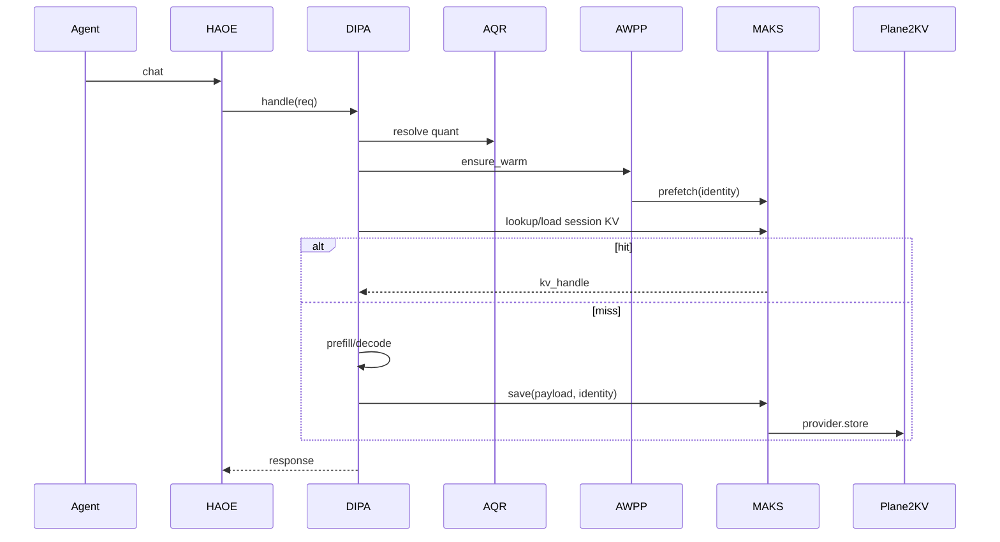
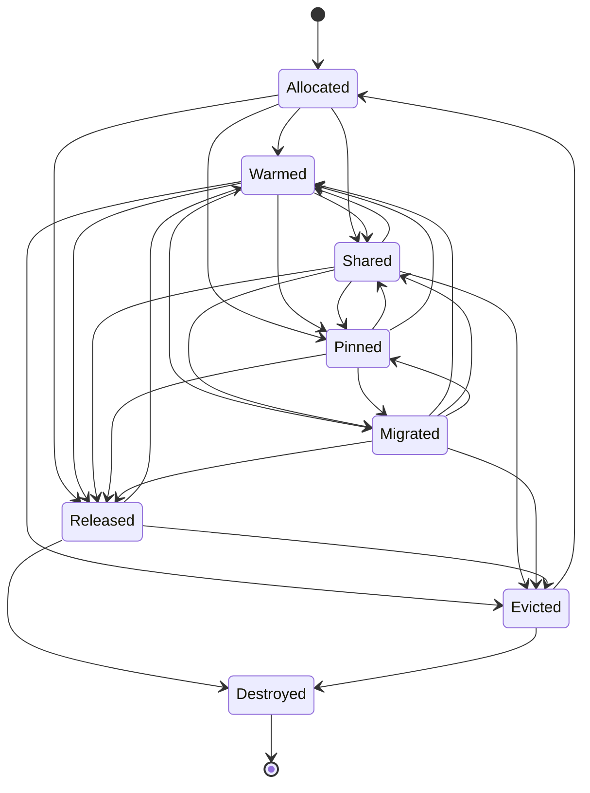
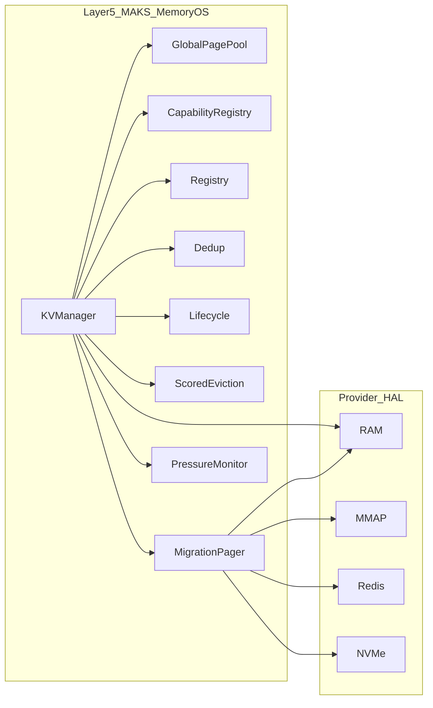
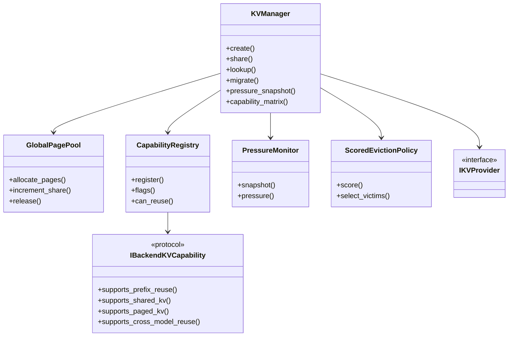
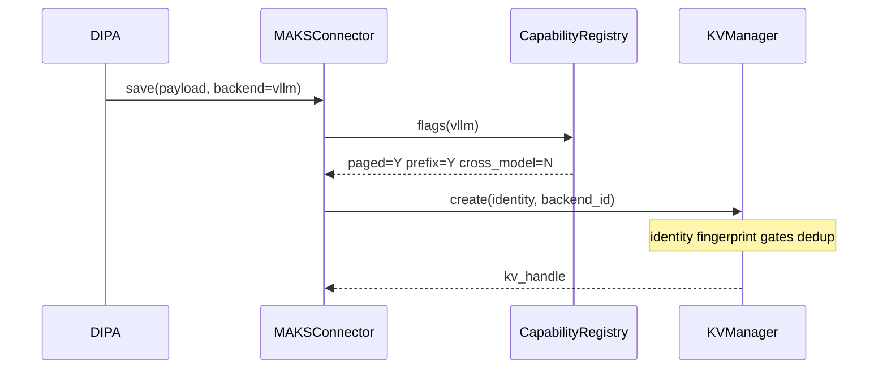

# MAKS Diagrams

## Sequence — DIPA lookup / reuse

```mermaid
sequenceDiagram
  participant Agent
  participant HAOE
  participant DIPA
  participant AQR
  participant AWPP
  participant MAKS
  participant Plane2 as Plane2KV

  Agent->>HAOE: chat
  HAOE->>DIPA: handle(req)
  DIPA->>AQR: resolve quant
  DIPA->>AWPP: ensure_warm
  AWPP->>MAKS: prefetch(identity)
  DIPA->>MAKS: lookup/load session KV
  alt hit
    MAKS-->>DIPA: kv_handle
  else miss
    DIPA->>DIPA: prefill/decode
    DIPA->>MAKS: save(payload, identity)
    MAKS->>Plane2: provider.store
  end
  DIPA-->>HAOE: response
```

## State machine

```mermaid
stateDiagram-v2
  [*] --> Allocated
  Allocated --> Warmed
  Allocated --> Shared
  Allocated --> Pinned
  Allocated --> Released
  Warmed --> Shared
  Warmed --> Pinned
  Warmed --> Migrated
  Warmed --> Released
  Warmed --> Evicted
  Shared --> Pinned
  Shared --> Migrated
  Shared --> Warmed
  Shared --> Released
  Shared --> Evicted
  Pinned --> Shared
  Pinned --> Warmed
  Pinned --> Migrated
  Pinned --> Released
  Migrated --> Warmed
  Migrated --> Shared
  Migrated --> Pinned
  Migrated --> Released
  Migrated --> Evicted
  Released --> Evicted
  Released --> Destroyed
  Released --> Warmed
  Evicted --> Destroyed
  Evicted --> Allocated
  Destroyed --> [*]
```

## Data flow

```mermaid
flowchart LR
  subgraph control [Layer5_MAKS_MemoryOS]
    Mgr[KVManager]
    Pool[GlobalPagePool]
    Cap[CapabilityRegistry]
    Reg[Registry]
    Dedup[Dedup]
    Life[Lifecycle]
    Evict[ScoredEviction]
    Mig[MigrationPager]
    Press[PressureMonitor]
  end
  subgraph store [Provider_HAL]
    RAM
    MMAP
    Redis
    NVMe
  end
  Mgr --> Pool
  Mgr --> Cap
  Mgr --> Reg
  Mgr --> Dedup
  Mgr --> Life
  Mgr --> Evict
  Mgr --> Mig
  Mgr --> Press
  Mig --> RAM
  Mig --> MMAP
  Mig --> Redis
  Mig --> NVMe
  Mgr --> RAM
```

## Class diagram (Memory OS core)

```mermaid
classDiagram
  class KVManager {
    +create()
    +share()
    +lookup()
    +migrate()
    +pressure_snapshot()
    +capability_matrix()
  }
  class GlobalPagePool {
    +allocate_pages()
    +increment_share()
    +release()
  }
  class CapabilityRegistry {
    +register()
    +flags()
    +can_reuse()
  }
  class PressureMonitor {
    +snapshot()
    +pressure()
  }
  class ScoredEvictionPolicy {
    +score()
    +select_victims()
  }
  class IKVProvider {
    <<interface>>
  }
  class IBackendKVCapability {
    <<protocol>>
    +supports_prefix_reuse()
    +supports_shared_kv()
    +supports_paged_kv()
    +supports_cross_model_reuse()
  }
  KVManager --> GlobalPagePool
  KVManager --> CapabilityRegistry
  KVManager --> PressureMonitor
  KVManager --> ScoredEvictionPolicy
  KVManager --> IKVProvider
  CapabilityRegistry --> IBackendKVCapability
```

## Capability adaptation sequence

```mermaid
sequenceDiagram
  participant DIPA
  participant Connector as MAKSConnector
  participant Cap as CapabilityRegistry
  participant Mgr as KVManager
  DIPA->>Connector: save(payload, backend=vllm)
  Connector->>Cap: flags(vllm)
  Cap-->>Connector: paged=Y prefix=Y cross_model=N
  Connector->>Mgr: create(identity, backend_id)
  Note over Mgr: identity fingerprint gates dedup
  Mgr-->>Connector: kv_handle
```
