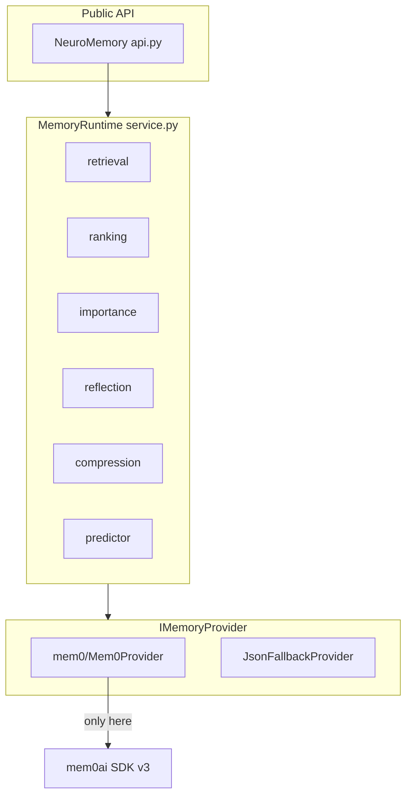
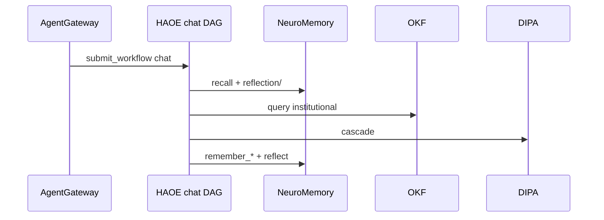
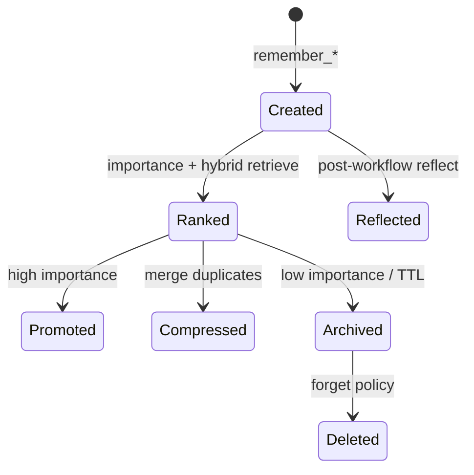

# Cognitive Memory Runtime — Architecture

Provider-agnostic **episodic / agent memory** for NeuroSwarm-Arm. Mem0 OSS v3 is one backend; business code uses only `NeuroMemory`.

For the full Context Operating System (understanding → plan → compress → assemble), see [docs/acr](../acr/README.md) — ACR wraps this runtime + OKF.

## Memory planes (do not merge)

| Plane | Package | Role |
|-------|---------|------|
| Cognitive / episodic | `neuroswarm_arm.runtime.memory` | Facts, tools, reflections, cost, performance |
| Institutional | OKF (`nexus_okf`) | Git-native knowledge — [ADR-0002](../okf/adr/0002-mem0-okf-separation.md) |
| Inference KV | `neuroswarm_arm.runtime.kv` + MAKS | Token KV blocks, not conversation memory |

Merge Mem0 facts + OKF text **only at prompt assembly** (`merge_mem0_okf`).

## Component diagram

## Chat sequence

## Lifecycle

## Namespaces

`users/` `agents/` `workflows/` `tools/` `benchmarks/` `prompts/` `system/` `swarm/` `reflection/` `reasoning/` `performance/` `cost/` `planner/` `router/` `execution/` `latency/` `evolution/`

## Mem0 v3 constraints

- ADD-only extraction (no in-place UPDATE/DELETE merge)
- `search(..., filters={"user_id": ...})` — entity IDs inside `filters`
- No `enable_graph` / Neo4j — entity linking is built-in; app graph is `graph.py`
- Install: `mem0ai[nlp]` + spaCy when Python ≤3.12; else semantic-only / JSON provider
