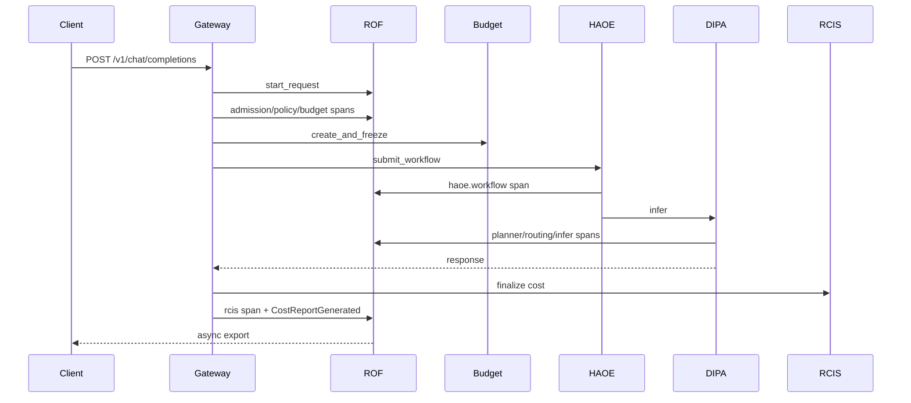

# Trace Flow

## Mandatory spine

```
nexus.armora.request
  └─ nexus.armora.admission
       └─ nexus.armora.policy
            └─ nexus.armora.budget
  └─ nexus.haoe.workflow
       └─ nexus.dipa.infer
            ├─ nexus.dipa.planner
            ├─ nexus.dipa.routing
            ├─ nexus.aqr.quant (connector)
            ├─ nexus.awpp.warm (connector)
            ├─ nexus.maks.kv (connector)
            ├─ nexus.dipa.backend
            └─ nexus.dipa.streaming
  └─ nexus.armora.rcis
  └─ nexus.rof.export
```

## Sequence



## Context propagation

- `RuntimeTraceContext` in `contextvars` (AsyncIO-safe)
- Carrier: `inject()` / `extract()` for worker pools + streaming
- HAOE: `CorrelationIds` ↔ `RuntimeTraceContext.from_haoe_correlation`
- Baggage keys: `nexus.request_id`, `nexus.envelope_id`, …
