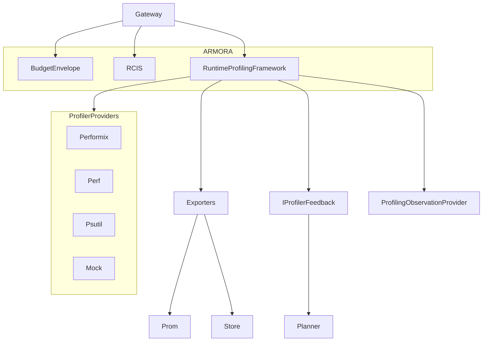
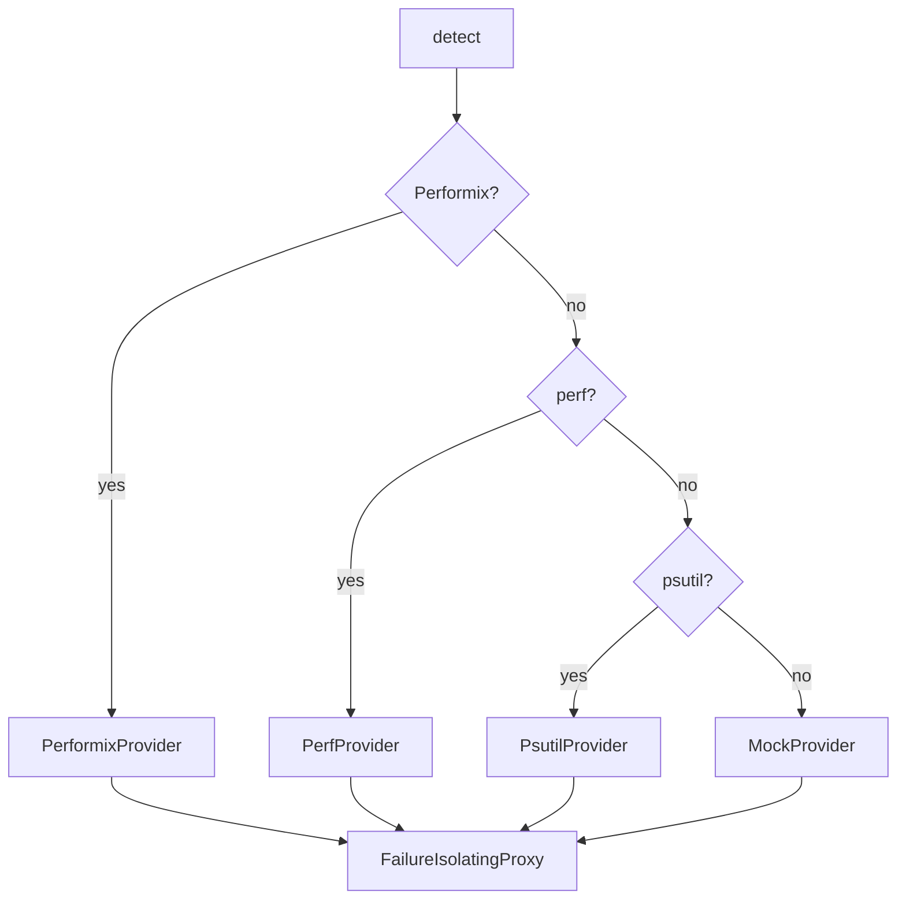
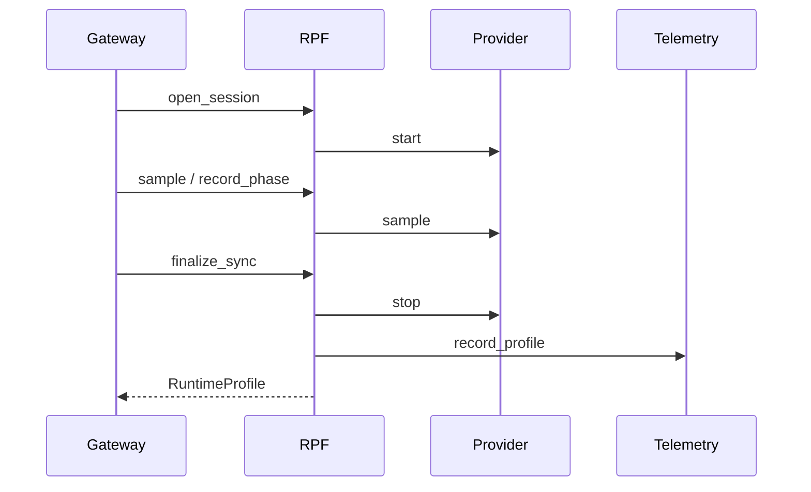

# RPF Diagrams

## Ownership

```mermaid
flowchart TB
  Gateway --> Budget
  Gateway --> RCIS
  Gateway --> RPF
  subgraph armora [ARMORA]
    Budget[BudgetEnvelope]
    RCIS[RCIS]
    RPF[RuntimeProfilingFramework]
  end
  RPF --> Providers
  subgraph Providers [ProfilerProviders]
    Performix
    Perf
    Psutil
    Mock
  end
  RPF --> Exporters
  Exporters --> Prom
  Exporters --> Store
  RPF --> Feedback[IProfilerFeedback]
  Feedback --> Planner
  RPF --> AROP[ProfilingObservationProvider]
```

## Capability cascade

```mermaid
flowchart TD
  start[detect] --> px{Performix?}
  px -->|yes| usePx[PerformixProvider]
  px -->|no| pf{perf?}
  pf -->|yes| usePerf[PerfProvider]
  pf -->|no| ps{psutil?}
  ps -->|yes| usePs[PsutilProvider]
  ps -->|no| useMock[MockProvider]
  usePx --> wrap[FailureIsolatingProxy]
  usePerf --> wrap
  usePs --> wrap
  useMock --> wrap
```

## Request sequence

```mermaid
sequenceDiagram
  participant G as Gateway
  participant R as RPF
  participant P as Provider
  participant T as Telemetry
  G->>R: open_session
  R->>P: start
  G->>R: sample / record_phase
  R->>P: sample
  G->>R: finalize_sync
  R->>P: stop
  R->>T: record_profile
  R-->>G: RuntimeProfile
```
