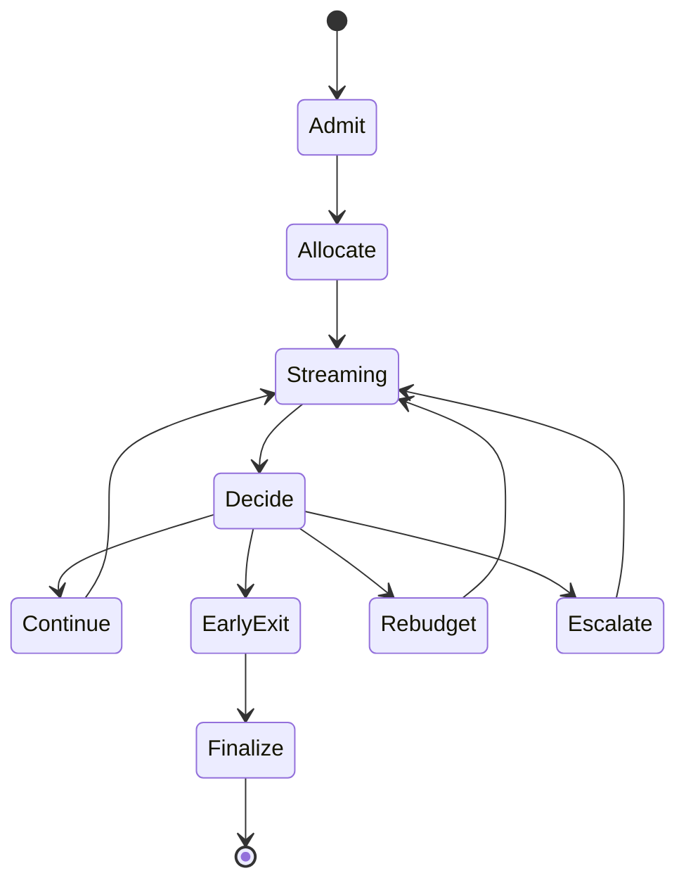

# RTG Architecture

## Placement

```
Gateway (main.py)
  ├─ build_rtg() → RTGRuntime
  ├─ DIPAReasoningHook(rtg) → IReasoningHook
  └─ build_dipa(reasoning_hook=...)
        └─ ExecutionPipeline.on_admit / on_chunk / on_complete
```

ADR: connectors not ownership. DIPA never imports `runtime.rtg` concretes.

## Modules

| Package | Role |
|---------|------|
| `sensors/` | Entropy, confidence, complexity, plateau, KV, semantic, SLO |
| `estimators/` | BudgetPredictor (TALE), ROI, answer stability |
| `policy/` | L0 heuristics, L1 detectors, L2 SW-UCB, L3 PPO scaffold |
| `control/` | Allocator, streaming controller, swarm water-filling |
| `telemetry/` | Prometheus bridge, OTEL stub, HardwareMonitor |
| `hooks/` | `DIPAReasoningHook` |

## Control loop



## Actions

`CONTINUE | PAUSE | STOP_EARLY | INCREASE_BUDGET | DECREASE_BUDGET |
ESCALATE_TIER | DOWNGRADE_TIER | INVOKE_TOOL | SKIP_REASONING |
EARLY_COMMIT | SWITCH_QUANT | SWITCH_BACKEND`

## Policy hierarchy

1. **L0** hard constraints (KV/memory/SLO/energy/tool conf)
2. **L1** streaming detectors (entropy, plateau, DEER transitions, ROI)
3. **L2** SW-UCB adaptive thresholds (REFRAIN)
4. **L3** PPO scaffold (offline; Mem0 profile key later)

## Algorithms

**Initial budget:**  
\(B_0 = \mathrm{clip}(B_{min}, f(c)\cdot B_{base}\cdot(1-\alpha t), B_{max})\) then L0 scales.

**Marginal ROI:**  
\(U_t = \Delta\hat{acc} / (\Delta tokens\cdot cost + \Delta latency)\) — stop if \(U_t < \tau\).

**SW-UCB:** arms = confidence thresholds; reward = quality − β·norm_tokens.

**Swarm:** water-fill global pool by `priority × (1−conf) / cost`.

## Config

`NSA_RTG_*` env + YAML under `runtime/rtg/config/`.
