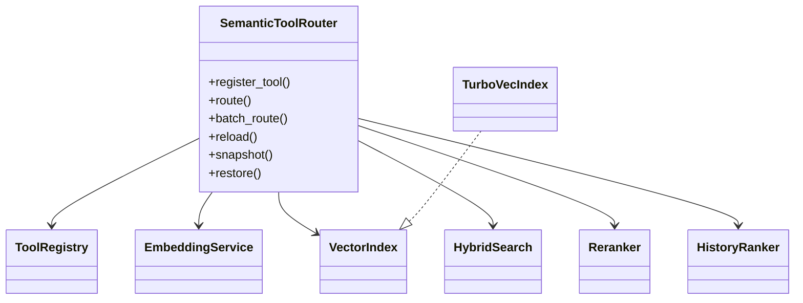

# Architecture

## Class diagram

## What this is (and is not)

- **In-process tool registry + semantic top-K selector.** The router ranks registered MCP tool *schemas* and injects only top-K into the LLM prompt.
- **Not** a transparent MCP proxy. Tool execution still goes through the agent/gateway; the router only selects which schemas enter context.

## Embedding + index (honest defaults)

| Piece | Reality |
|-------|---------|
| Default encoder | `BAAI/bge-small-en-v1.5` — **~33.4M params, 384-dim** |
| TurboVec | **2/4-bit** product quantization; default **4-bit** (~1.92 MB for 10k×384×4-bit) |
| Fallback | Exact numpy ANN when `turbovec` is missing (health `degraded` unless `NSA_ROUTER_ANN_BACKEND=exact`) |
| Hash embedder | Dev/CI only when `NSA_ROUTER_ALLOW_HASH=1`; otherwise fail-loud |

## Thresholds (dual gates)

| Gate | Env | Default | Role |
|------|-----|---------|------|
| Re-rank / expand trigger | `NSA_ROUTER_THRESHOLD` or `NSA_ROUTER_RERANK_TRIGGER` | **0.42** | Low top-1 semantic score → expand candidates |
| High-confidence | `NSA_ROUTER_HIGH_CONF_GATE` | **0.85** | Sets `RoutingResult.high_confidence`; caps DIPA/RTG `thinking_token_cap` |

Measured evidence (6 live MCP templates, ~16% schema-token cut) lives in `docs/evidence/latest/LAYER_SCORECARD.md` / `MEASURED.md`. Do not claim 40→3 / 92% without the mcpga bench artifact.

## Design rules

- Router owns tool selection; DIPA never indexes tools.
- Only top-K MCP schemas enter the LLM prompt.
- TurboVec is default ANN; exact numpy is Axion-safe fallback (logged + health-visible).
- Mem0 / OKF / ARMORA / AQR signals feed reranking, not hard gates (except security deny policies).
