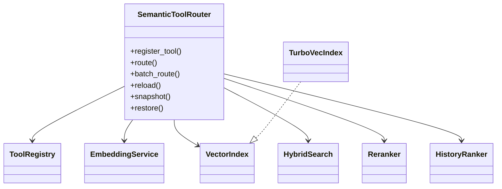

# Architecture

## Class diagram

## What this is (and is not)

- **In-process tool registry + semantic top-K selector.** The router ranks registered MCP tool *schemas* and injects only top-K into the LLM prompt.
- **Not** a transparent MCP proxy. Tool execution still goes through the agent/gateway; the router only selects which schemas enter context.

## Embedding + index (honest defaults)

| Piece | Reality |
|-------|---------|
| Default encoder | `BAAI/bge-small-en-v1.5` — **~33.4M params, 384-dim** |
| Default embed backend | **FastEmbed** (`NSA_ROUTER_EMBEDDING_BACKEND=fastembed`) via ONNX Runtime — preferred on ARM gateway |
| Sentence-Transformers | Optional fallback when FastEmbed unavailable |
| TurboVec | **4-bit** TurboQuant product quantization when `tools >= NSA_ROUTER_TURBOVEC_MIN_TOOLS` (default **0** — activate whenever the wheel imports); below a raised threshold → exact float32. Not an int8 index. |
| Fallback | Exact numpy ANN when turbovec missing or N small (health `ok` when intentional; `degraded` only if turbovec import failed) |
| Hash embedder | Dev/CI only when `NSA_ROUTER_ALLOW_HASH=1`; otherwise fail-loud |
| SVE2 codebook kernels | **Not** claimed for Pillar 2 (`sve_kernels_active=false`); ARM win is FastEmbed/ONNX + TurboVec NEON |

Measured evidence for 40→3 token reduction requires FastEmbed + the ≥40-tool catalog. Do not cite a public “MCPGA paper” uplift — use `benchmarks/router_mcpga.py` as an internal harness.

## Thresholds (dual gates)

| Gate | Env | Default | Role |
|------|-----|---------|------|
| Re-rank / expand trigger | `NSA_ROUTER_THRESHOLD` or `NSA_ROUTER_RERANK_TRIGGER` | **0.42** | Low top-1 semantic score → expand candidates |
| High-confidence | `NSA_ROUTER_HIGH_CONF_GATE` | **0.70** | Sets `RoutingResult.high_confidence`; caps DIPA/RTG `thinking_token_cap` (FastEmbed-calibrated) |

Measured evidence for **≥40 live tool schemas** + FastEmbed lives in `docs/evidence/latest/` and `benchmarks/router_mcpga.py` (internal harness — not a public paper). Live `reduction≈0.89` is a **schema-token** ratio, not a literal 40→3 / 92% tool-count cut. Do not claim 40→3 / 92% without a FastEmbed measurement artifact that reports both token ratio and top-k count.

High-conf → `thinking_token_cap=256` applies when `RoutingResult.high_confidence` is consumed (tool / gated path). Ordinary chat turns use the RTG default cap and do not force 256.

## Design rules

- Router owns tool selection; DIPA never indexes tools.
- Only top-K MCP schemas enter the LLM prompt.
- TurboVec is default ANN; exact numpy is Axion-safe fallback (logged + health-visible).
- Mem0 / OKF / ARMORA / AQR signals feed reranking, not hard gates (except security deny policies).
