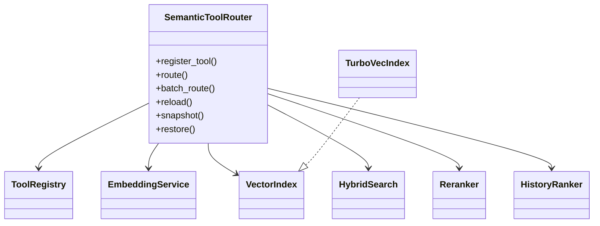

# Architecture

## Class diagram

## Design rules

- Router owns tool selection; DIPA never indexes tools.
- Only top-K MCP schemas enter the LLM prompt.
- TurboVec is default ANN; exact numpy is Axion-safe fallback.
- Mem0 / OKF / ARMORA / AQR signals feed reranking, not hard gates (except security deny policies).
