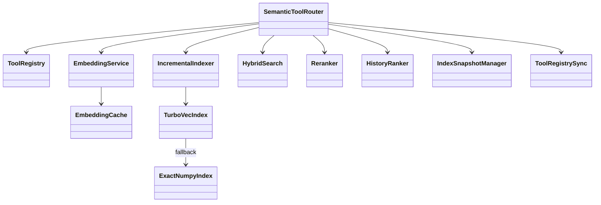

# Class diagram

```mermaid
classDiagram
  direction TB
  class SemanticToolRouter
  class ToolRegistry
  class EmbeddingService
  class EmbeddingCache
  class IncrementalIndexer
  class TurboVecIndex
  class ExactNumpyIndex
  class HybridSearch
  class Reranker
  class HistoryRanker
  class IndexSnapshotManager
  class ToolRegistrySync
  SemanticToolRouter --> ToolRegistry
  SemanticToolRouter --> EmbeddingService
  SemanticToolRouter --> IncrementalIndexer
  SemanticToolRouter --> HybridSearch
  SemanticToolRouter --> Reranker
  SemanticToolRouter --> HistoryRanker
  SemanticToolRouter --> IndexSnapshotManager
  SemanticToolRouter --> ToolRegistrySync
  EmbeddingService --> EmbeddingCache
  IncrementalIndexer --> TurboVecIndex
  TurboVecIndex --> ExactNumpyIndex : fallback
```
