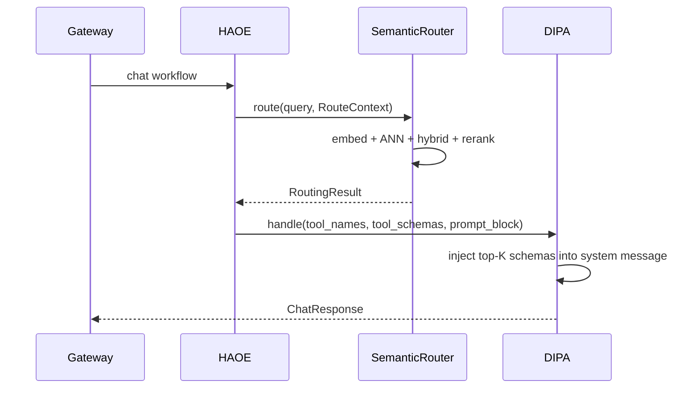

# Sequence

```mermaid
sequenceDiagram
  participant GW as Gateway
  participant HAOE as HAOE
  participant R as SemanticRouter
  participant DIPA as DIPA
  GW->>HAOE: chat workflow
  HAOE->>R: route(query, RouteContext)
  R->>R: embed + ANN + hybrid + rerank
  R-->>HAOE: RoutingResult
  HAOE->>DIPA: handle(tool_names, tool_schemas, prompt_block)
  DIPA->>DIPA: inject top-K schemas into system message
  DIPA-->>GW: ChatResponse
```
